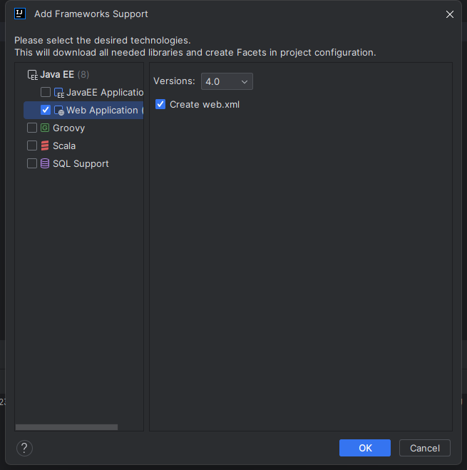

视频地址：https://www.bilibili.com/video/BV1Fy4y1Y7n6

# 01基本概念

## 客户端和服务器沟通流程

想要对外交流，得有服务器软件（Tomcat），恰巧Tomcat也是java开发的！


客户端发请求给Tomacat，Tomcat执行java代码，后续在经过Tomcat返回给客户端

## Tomcat

https://tomcat.apache.org/（9版本）


安装位置：D:\work\environment\apache-tomcat-9.0.98

点击\bin\startup启动,访问http://127.0.0.1:8080/


一个服务器软件tomcat下可能有许多应用，都可以放到webapps下面被外部访问。


## 什么是协议

制定一个标准，大家都遵守这个标准！


## 网络互连模型


## 请求过程


# 02集线器、网桥、交换机

## 创建项目

NetWork


创建moudle


创建Main


添加web支持



添加静态资源


把项目部署到Tomcat


运行访问

http://localhost:8080/hello/test.html test页面

http://localhost:8080/hello/默认会访问index.xxx

添加servlet依赖


修改test页面

```java
<html lang="en">
<head>
    <meta charset="UTF-8">
    <title>登录</title>
</head>
<body>
<form action="/hello/login" method="get">
    <div>用户名<input name="username"></div>
    <div>密码<input name="password"></div>
    <button type="submit">登录</button>
</form>
</body>
</html>
```

创建后端

```java
package com.mj.servlet;

import javax.servlet.ServletException;
import javax.servlet.annotation.WebServlet;
import javax.servlet.http.HttpServlet;
import javax.servlet.http.HttpServletRequest;
import javax.servlet.http.HttpServletResponse;
import java.io.IOException;

@WebServlet("/login")
public class LoginServlet extends HttpServlet {
    @Override
    protected void doGet(HttpServletRequest req, HttpServletResponse resp) throws ServletException, IOException {
        doPost(req, resp);
    }

    @Override
    protected void doPost(HttpServletRequest req, HttpServletResponse resp) throws ServletException, IOException {
        req.getParameter("useranme");
        req.getParameter("password");
        resp.getWriter().write("login success");
    }
}
```

## 计算机之间的通信基础

需要得知对方的IP地址

最终是根据MAC地址(网卡地址)，输送数据到网卡，被网卡接收

如果网卡发现数据的目标MAC地址是自己，就会将数据传递给上一层进行处理

如果网卡发现数据的目标MAC地址不是自己，就会将数据丢弃，不会传递给上一层进行处理

## Cisco Packet Tracerv7.3下载安装

链接：https://pan.baidu.com/s/1w0xGtU_RjOaiqpZZG2vsPQ?pwd=3arp 
提取码：3arp 
--来自百度网盘超级会员V3的分享

## 计算机之间的连接方式 - 网线直连

（需要使用交叉线而不是直通线）

先创建电脑和网线


设置两台ip


ping一下


简单pdu测一下


协议是ICMP的原因是，上一步ping的时候已经通过ARP广播协议获取到MAC地址了！！！

### 完整ARP+ICMP协议过程


## 计算机之间的连接方式 - 同轴电缆{(Coaxial)


## 计算机之间的连接方式 - 集线器(Hub)


集线器没有智商，只会**广播**，ARP阶段和ICMP阶段都会广播！！！


计算机1收到的ARP的ICMP消息都会丢弃掉！设备越多，效率越低

## 计算机之间的连接方式-网桥(Bridge)


起到隔绝冲突域的作用，各个冲突域可以同时发送数据。


网桥的问题是，只有两个接口，同一边设备多的话还是会有问题！

## 计算机之间的连接方式-交换机(Switch)-局域网的最终方案


他会学习到各个接口的mac地址，就不需要广播了（第一次ARP需要广播）


如果只有交换机的话，全球都使用交换机，会导致ARP广播风暴